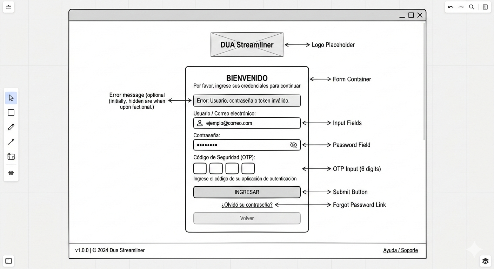
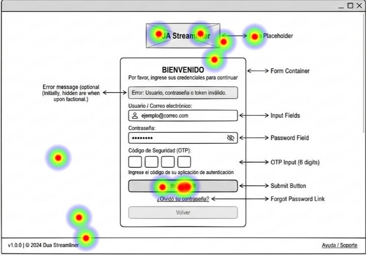
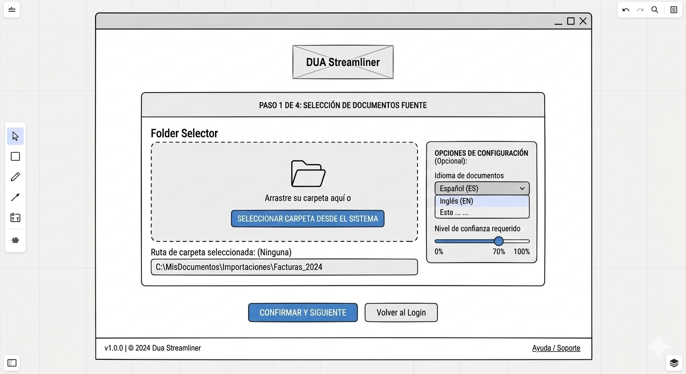
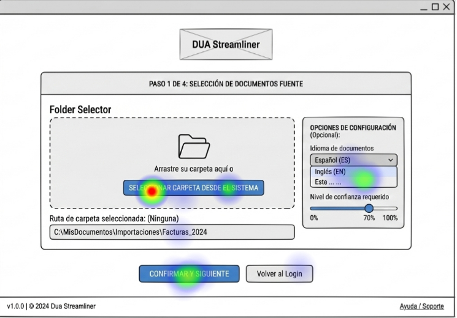
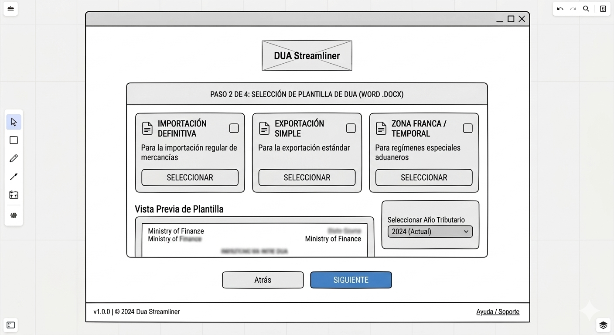
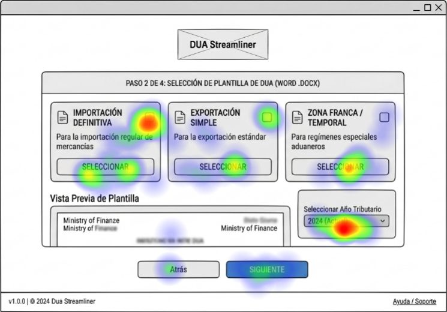
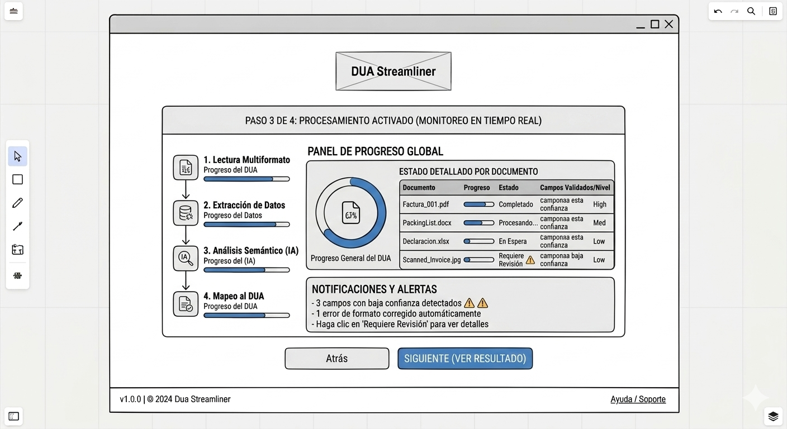
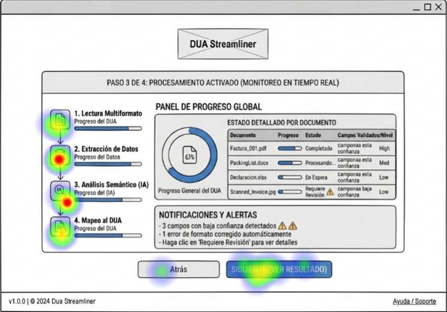
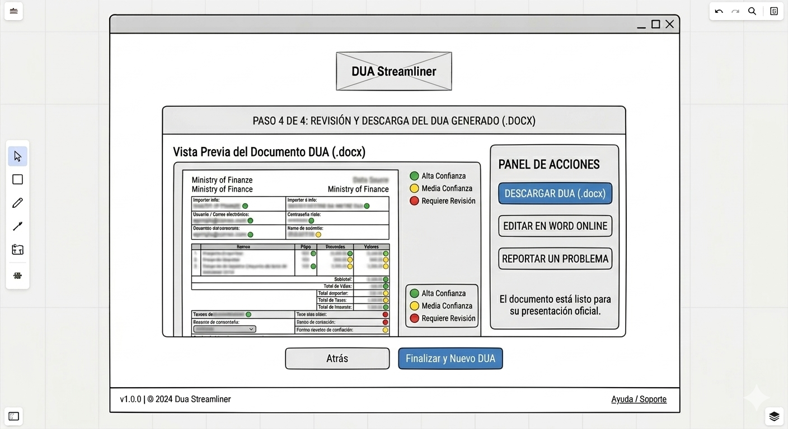
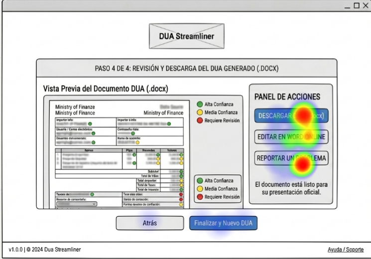

# Dua streamliner design

The main problem addressed by the DUA Streamliner is the complexity and inefficiency involved in preparing the customs declaration form (DUA) for importers and exporters. Currently, relevant information is scattered across multiple document types such as Excel files, Word documents, PDFs, and scanned invoices. These documents often follow different formats and structures, requiring manual review and data entry. This process is time-consuming, prone to human error, and demands detailed knowledge of customs terminology and regulatory requirements, which increases operational costs and delays.

The proposed solution is an automated, AI-powered system that processes a single folder path provided by the user, containing all related documents regardless of format. The system will use multiformat reading engines to extract data from Excel and Word files, structured and unstructured text from PDFs, and apply advanced OCR to scanned images. Through semantic analysis powered by trained AI models specialized in customs terminology, it will contextually interpret and extract key data such as importer/exporter information, product descriptions, values (FOB/CIF), Incoterms, transport details, invoice data, country of origin, and applicable customs regime. The extracted information will then be automatically mapped to the official DUA template defined by the Ministry of Finance, validated for basic consistency, and flagged when ambiguity or low confidence is detected.

The expected results include a significant reduction in manual workload, fewer data-entry errors, and faster DUA preparation. The system will generate a fully pre-filled Word document (.docx) aligned with the official DUA template, using visual confidence indicators (green for high confidence, yellow for medium confidence, and red for fields requiring review). This approach enhances efficiency, improves compliance accuracy, and allows customs professionals to focus on validation and decision-making rather than repetitive administrative tasks.

# 1. Frontend design
## 1.1 Technology stack
- Application type: webapp
- Web framework: ReactJS version 19.2
- NodeJS version 21
- TypeScript 5.9.3
- Unit testing: Jest 30.2.0
- Integration testing: Playwright 1.58.2
- Cloud service: AWS
- Hosted by Amazon Elastic Beanstalk
- Code repositories: GitHub
- CI CD by GitHub actions 
- Enviroments: AWS Elastic Beanstalk Environments
- Observability by Wiston
- Zod 4.3.6 to data validation
- Prettier 3.8.1
- esLint 10.0.2

## 1.2 UX UI analysis
### Core business process
#### Login
1. User enters their login, password, and the one-time token.  
2. If the login attempt fails, a message is displayed: *invalid username or password*.  
3. If successful, access to the system is granted.  

#### Configure the Generator
1. Selection of folder with source documents (Excel, Word, PDF, scanned images).  
2. Configuration of reading and validation options (e.g., language, document type, required confidence level).  
3. Adjustment of specific rules according to the customs regime.  

#### Progress Monitoring
1. The system displays a progress panel with indicators for each stage (reading, extraction, semantic analysis, mapping to the DUA).  
2. Color codes or progress bars are used to facilitate understanding.  
3. Errors or low-confidence fields are notified in real time.  

#### Obtaining the Result
1. Automatic generation of a Word file (.docx) with the official format of the Ministry of Finance.  
2. Inclusion of visual confidence indicators (green, yellow, red).  
3. Option to download, review, and edit the document before official submission.  

#### Logout
1. The user selects the logout option.  
2. The system invalidates the token and closes the session.  
### Wireframes

#### Login Screen
This screen presents a centralized access form that integrates **Username**, **Password** (with visibility toggle option), and a specific field for the **OTP** (one-time token).  
It includes a **dynamic alert area** that only appears when invalid credentials are entered, prioritizing security and clarity before entering the system.  



#### Select Folder
Upload interface that allows the user to choose the source path of the documents; includes language selectors and a slider control to define the minimum confidence level required by the AI. 


#### Select DUA Template
Selection panel that displays the official variants of the form (Import, Export, etc.) through interactive cards and a preview of the corresponding `.docx` format.  


#### How to Monitor Process Progress
Real-time dashboard that breaks down the stages of extraction and semantic analysis, using progress bars and low-confidence alerts for each processed file.  


#### How the Final Result Looks
Closing screen that presents the generated document with a traffic-light system (green/yellow/red) applied to the data, and enables the final download of the Word file ready for submission to the Ministry of Finance.  



## 1.3 Component design strategy
- Use Atomic Design methodology to structure UI components (atoms, molecules, organisms, templates, pages) in React.  
- Develop all components using React 19.2 with TypeScript 5.9.3 to ensure type safety and maintainability.  
- Encapsulate styles per component using CSS Modules to avoid style conflicts and improve scalability.  
- CSS class naming convention follows: ComponentName-StyleName.  
- Use relative units (em/rem) for layout and typography to support responsive design.  
- Components support internationalization using react-i18next (v16.5.8).  
- Ensure component reusability and testability through unit tests with Jest 30.2.0.  
- Validate component behavior and user interactions through integration/end-to-end testing using Playwright 1.58.2.  
- Follow a modular folder structure separating components, hooks, services, and utilities.  
- No specific accessibility (a11y) requirements are defined for this application.

## 1.4 Security
- Multi-Factor Authentication (MFA) through AWS Cognito.  
- Mobile authenticator application (TOTP) supported.  
- Single Sign-On (SSO) through AWS Cognito (with optional external identity providers).  
- Authentication is handled by AWS Cognito.  
  
- **Roles:**  
- Manager  
- Customs Agent  
### Permissions by Role  

#### Manager  
  
- **Permission Code:** MANAGE_USERS  
- **Description:** Manage user CRUD operations.  
  
- **Permission Code:** VIEW_REPORTS  
- **Description:** Access operational and performance reports.  
  
- **Permission Code:** EDIT_TEMPLATES  
- **Description:** Modify or update available DUA templates.  
  
#### Customs Agent  
  
- **Permission Code:** LOAD_FILES  
- **Description:** Upload folders containing required data files.  
  
- **Permission Code:** GENERATE_DUA  
- **Description:** Initiates the AI process to generate a DUA.  
  
- **Permission Code:** DOWNLOAD_DUA  
- **Description:** Download generated DUA documents.  
  
---  
  
- AWS Secrets Manager is used to store environment variables, API keys, and sensitive configuration data.  
- **Server Name:** `customs-identity-service`

## 1.5 Layered design

- The frontend supports Server-Side Rendering (SSR) using React 19 with a Node.js runtime.

- If there is no authenticated session, the Authentication Layer is invoked via AWS Cognito.

- If authentication is successful, the requested view is rendered within the Components Layer.

- Components follow Atomic Design (atoms, molecules, organisms, templates, and pages).  
  Within components, a Hooks Layer connects UI interactions with the Services Layer.

- The Services Layer contains the core business logic of the application.

- Services may require access to the following layers:
  - Utils (helper functions and shared utilities)
  - ApiClients (external API communication)
  - Settings (configuration management)

- ApiClients contains all modules responsible for interacting with external services (e.g., AWS services, third-party APIs).

- Settings retrieves environment variables and secrets from AWS Secrets Manager during runtime.

- ApiClients read API endpoints, credentials, and configuration values from the Settings layer.

- All ApiClient requests and responses are mapped using Models (TypeScript interfaces/types), which are validated using a Data Validation layer (e.g., Zod).

- All layers can access shared modules such as:
  - Models
  - Utils
  - State Management (e.g., Redux Toolkit or React Context)

- A Notification Service layer enables asynchronous communication between services using event-driven patterns (e.g., AWS SNS/SQS or callbacks).

- Asynchronous operations (e.g., long-running DUA generation processes) are handled via events and callbacks through the Notification Service.

- The Logging Layer provides centralized logging of system events and errors (e.g., AWS CloudWatch).

- The Exception Handling Layer is shared across all layers to standardize error management and responses.

---

### Architecture Diagram 

				+----------------------+  
				| User Browser |  
				+----------+-----------+  
						|  
						v  
				+---------------------------+  
				| AWS (CloudFront / ALB) |  
				| NodeJS + React SSR |  
				+----------+----------------+  
						|  
				SSR Request Handling  
						|  
				Authentication  
				(AWS Cognito)  
						|  
				+----------------------+  
				| Components Layer |  
				| Atomic Design UI |  
				| Atoms → Pages |  
				+----------+-----------+  
						|  
				Hooks  
						|  
				Services Layer  
						|  
				+----------+-----------+-----------+  
						| | | |  
				Utils ApiClients Settings State Mgmt  
						|  
				AWS Secrets Manager  
						|  
				Secrets / Config

---

ApiClients → External APIs / AWS Services  
External Services → Notification Service (Events / Callbacks)

Shared Layers:

- Models (TypeScript)
    
- Zod Validation
    
- Redux / Context API
    
- Exception Handling
    
- Logging (AWS CloudWatch)
    

CI/CD:  
GitHub Repository → GitHub Actions → Build & Test (Jest / Playwright) → Deploy (AWS: EC2 / ECS / Amplify)

## 1.6 Design patterns
- Use Builder Pattern and Strategy Pattern to create the diffrent document processors such as wordx, xlsx, pdf, jpg, png. 
- NotificationService subscriptions works with Obsever pattern
- Use adapter pattern to decide the output format to be writen in the documents, use FormatAdapters y Concret Format such as: Paragraph, Bullets, Table, Label, Amount. 
- Singleton for: ExceptionHandling, Document Parsers, Utils, StateManagement, The Api Clients, Settings classes. 

## 1.7 Scaffold

The project scaffold under /src reflects the architectural decisions defined in sections 1.1 to 1.6.

The structure follows a layered architecture, separating concerns into Components, Hooks, Services, ApiClients, and shared modules such as Models, Utils, and State Management.

Atomic Design methodology is implemented within the components directory, organizing UI elements into atoms, molecules, organisms, templates, and pages.

Design patterns such as Strategy, Builder, Adapter, Observer, and Singleton are represented through dedicated folders (processors, adapters, notifications, and shared utilities).

Integration with external services (AWS Cognito, S3, AI processing services) is encapsulated within the apiClients layer, while configuration and secrets management are handled through the settings module.

This scaffold ensures scalability, maintainability, and alignment with the defined system architecture.

```
/src
│
├── app/
│   ├── layout.tsx
│   ├── page.tsx
│   └── routes/
│       ├── login.route.tsx
│       ├── dashboard.route.tsx
│       ├── generator.route.tsx
│       └── result.route.tsx
│
├── components/
│   ├── atoms/
│   │   ├── Button/
│   │   ├── Input/
│   │   ├── Label/
│   │   └── Loader/
│   │
│   ├── molecules/
│   │   ├── LoginForm/
│   │   ├── FileSelector/
│   │   └── ConfidenceSlider/
│   │
│   ├── organisms/
│   │   ├── LoginPanel/
│   │   ├── ProgressDashboard/
│   │   └── ResultViewer/
│   │
│   ├── templates/
│   │   ├── AuthTemplate/
│   │   └── DashboardTemplate/
│   │
│   └── pages/
│       ├── LoginPage/
│       ├── DashboardPage/
│       ├── GeneratorPage/
│       └── ResultPage/
│
├── hooks/
│   ├── useAuth.ts
│   ├── useDUAGenerator.ts
│   ├── useProgress.ts
│   └── useNotifications.ts
│
├── services/
│   ├── AuthService.ts
│   ├── DUAGeneratorService.ts
│   ├── DocumentProcessingService.ts
│   ├── NotificationService.ts
│   └── ValidationService.ts
│
├── apiClients/
│   ├── CognitoClient.ts
│   ├── S3Client.ts
│   ├── AIProcessingClient.ts
│   └── BackendClient.ts
│
├── models/
│   ├── User.ts
│   ├── DUA.ts
│   ├── Document.ts
│   └── ApiResponses.ts
│
├── validation/
│   ├── auth.schema.ts
│   ├── dua.schema.ts
│   └── document.schema.ts
│
├── utils/
│   ├── Logger.ts
│   ├── Formatter.ts
│   ├── FileUtils.ts
│   └── ErrorHandler.ts
│
├── state/
│   ├── store.ts
│   ├── auth.slice.ts
│   ├── dua.slice.ts
│   └── ui.slice.ts
│
├── settings/
│   ├── config.ts
│   └── secretsManager.ts
│
├── adapters/
│   ├── FormatAdapter.ts
│   ├── ParagraphAdapter.ts
│   ├── TableAdapter.ts
│   ├── LabelAdapter.ts
│   └── AmountAdapter.ts
│
├── processors/
│   ├── DocumentProcessor.ts
│   ├── strategies/
│   │   ├── PdfProcessor.ts
│   │   ├── WordProcessor.ts
│   │   ├── ExcelProcessor.ts
│   │   └── ImageProcessor.ts
│   │
│   └── builder/
│       └── ProcessorBuilder.ts
│
├── notifications/
│   ├── Subject.ts
│   ├── Observer.ts
│   └── NotificationSubscriber.ts
│
├── middleware/
│   ├── authMiddleware.ts
│   └── roleMiddleware.ts
│
├── logging/
│   └── WinstonLogger.ts
│
└── tests/
    ├── unit/
    └── integration/


```
# 2. Backend design

## Technology stack

- REST API over HTTPS  
- API Gateway (AWS API Gateway) + Hosting (AWS Elastic Beanstalk)  
- API standard defined using OpenAPI 3.0 (Swagger)  
- For asynchronous operations and notifications:
  - AWS SNS (event publishing)
  - AWS SQS (message queuing)
- Load balancing is managed internally by AWS services (no manual configuration required)  
- API coding language: C#, ASP.NET Core (.NET 8)  
- Monorepo solution shared with frontend  
  - Backend folder: `/duabusiness`  

### Services vs Microservices
The system is implemented as a **Modular Monolith**, allowing:
- Lower complexity in development and deployment  
- Clear modular separation internally  
- Future migration to microservices if required  

---

## Security

- HTTPS enforced (TLS 1.2+)  

- Encryption:
  - Data at rest: AES-256 (AWS S3 and RDS)  
  - Data in transit: HTTPS  

- Authentication & Authorization:
  - JWT tokens validated via AWS Cognito  
  - Role-based access control:
    - Manager  
    - Customs Agent  

- Payload size:
  - Default: 10MB  
  - File upload endpoints: up to 200MB (streaming enabled)  

- Rate limiting:
  - 100 requests per second per client  
  - Burst limit: 200 requests  

- Data lifecycle:
  - Production data retention: 30 days  
  - Archived to AWS S3 Glacier after retention period  

---

## Observability

- Events to be logged:
  - Authentication attempts  
  - File uploads  
  - Document processing stages  
  - AI extraction results  
  - Errors and exceptions  
  - Low-confidence detections  

- Platform:
  - AWS CloudWatch Logs  

- Dashboards:
  - AWS CloudWatch Dashboards  

- Tracing:
  - AWS X-Ray  

---

## Infrastructure (DevOps)

- CI/CD:
  - GitHub Actions  

- Deployment environments:
  - Development  
  - Staging  
  - Production  

- Deployment strategy:
  - AWS Elastic Beanstalk deployments via GitHub Actions  

- Infrastructure as Code:
  - Terraform or AWS CloudFormation  

---

## Availability

- Target uptime: **99.99%**  

- Estimated downtime:
  - ~52.6 minutes per year  

### Single Points of Failure and Mitigation

- API Layer:
  - Managed by AWS → automatic recovery  

- Database (RDS):
  - Multi-AZ deployment for failover  

- Storage (S3):
  - High durability and redundancy  

- Background processing:
  - SQS retry policies and message reprocessing  

### Recovery Strategy

- Automatic instance restart  
- Daily database backups  
- S3 versioning enabled  

---

## Scalability

The following components scale with increased request load:

- AWS API Gateway (request scaling)  
- AWS Elastic Beanstalk (auto-scaling instances)  
- AWS SQS (decoupled processing)  
- AWS S3 (automatic storage scaling)  

### Strategy

- Stateless API design  
- Event-driven architecture  
- Parallel document processing  

---

## Backend key workflows

### Upload files to generate DUA

1. The backend receives the list of files to be uploaded  
2. A streaming transfer is initialized file by file  
3. Files are received in raw format  
4. Files are stored in AWS S3  
5. Metadata is stored in AWS RDS  
6. An event is published to SNS  
7. SQS queues the processing task  
8. A background worker processes the documents  
9. Progress updates are generated  

---

### Setup DUA template

1. Manager uploads or selects a DUA template  
2. Template file is stored in AWS S3  
3. Template metadata is stored in RDS  
4. Template structure is validated  
5. Template is made available for system usage  

---

## Architecture diagrams in layers

The system follows the **C4 model**, including:

- Context diagram  
- Container diagram  
- Code (layered) diagram  

### Context Diagram
```
User (Customs Agent / Manager)
              |
v
Frontend (React Application)
|
v
Backend API (.NET)
|
+--> AWS Cognito (Authentication)
+--> AWS S3 (File Storage)
+--> AWS RDS (Database)
+--> AWS SNS/SQS (Messaging)
```
### Container Diagram
```
[Frontend - React (Elastic Beanstalk)]
|
v
[AWS API Gateway]
|
v
[Backend API - ASP.NET Core (Elastic Beanstalk)]
|
+----+----+----+
| | | |
[AWS RDS] [AWS S3] [AWS SQS] [AWS SNS]
``` 
### Layered architecture
```
+--------------------------+
| API Layer (Controllers)  |
+------------+-------------+
             |
+------------v-------------+
| Application Layer        |
| (Services / Use Cases)   |
+------------+-------------+
             |
+------------v-------------+
| Domain Layer             |
| (Models, Business Logic) |
+------------+-------------+
             |
+------------v-------------+
| Infrastructure Layer     |
| (S3, RDS, SNS, SQS, AI)  |
+--------------------------+
``` 


---

## Design Considerations

- System configurations and secrets are managed using AWS Secrets Manager  

- Resource allocation:
  - API instances scale automatically via Elastic Beanstalk  
  - Database configured with Multi-AZ deployment  

- Algorithms:
  - Document processing strategies based on file type  
  - AI-based semantic analysis configurable  

- Agent prototypes:
  - AI processing agents abstracted via interfaces  

- Integration points:
  - AWS S3 (storage)  
  - AWS RDS (database)  
  - AWS SNS/SQS (messaging)  
  - External AI processing services  

---

## Source Code

- A specialized agent will generate the backend skeleton based on this architecture  

- The agent will:
  - Generate folder structure  
  - Create base classes and interfaces  
  - Avoid implementing business logic  

- Directory structure aligned with architecture:
```
/duabusiness
├── api/
├── application/
├── domain/
├── infrastructure/
├── processors/
├── adapters/
├── configuration/
├── logging/
└── tests/
``` 

### Key folders

- API Controllers: `/duabusiness/api/controllers`  
- Application Services: `/duabusiness/application/services`  
- Domain Models: `/duabusiness/domain/models`  
- Infrastructure: `/duabusiness/infrastructure`  